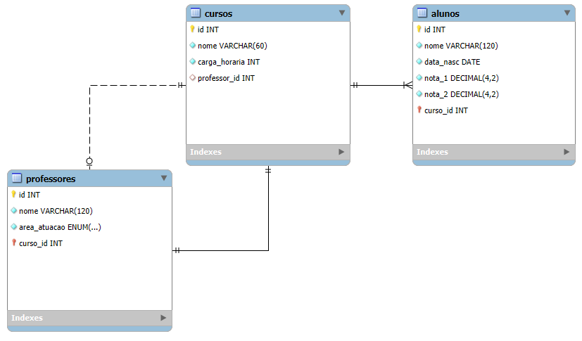

# Atividades de Banco de Dados 

## ETAPA 1 - Modelagem Conceitual

Este projeto apresenta a modelagem conceitual de um sistema acadêmico, contendo três entidades principais: **CURSO, PROFESSOR e ALUNO**. A modelagem foi realizada utilizando o Visio, respeitando as regras de cardinalidade e integridade dos dados.

+ **CURSO:** Possui identificador, título, carga horária e professor (opcional).
+ **PROFESSOR:** Possui identificador, nome, área de atuação e leciona um único curso.
+ **ALUNO:** Possui identificador, nome, data de nascimento e notas, estando vinculado a um curso.

### Relacionamentos:

- 1:N → Um curso pode ter vários alunos.
- 1:1 → Um curso é lecionado por um único professor

#### A modelagem completa está disponível na imagem gerada e incluída neste repositório.

## ETAPA 2 - Modelagem Lógica 

Na Etapa 2 das atividades de banco de dados, a modelagem lógica deve ser feita no MySQL Workbench, convertendo as entidades da modelagem conceitual em tabelas, seus atributos em colunas, e definindo tipos de dados e relacionamentos.

### Destaques:

+ Nomeação: Usar plural para tabelas e singular para colunas.
+ Professores: Para a coluna Área de atuação, é necessário pesquisar um tipo de dado adequado para armazenar uma lista fixa de valores.
+ Entrega: O arquivo deve ser salvo no repositório tanto na versão original quanto exportado como imagem.

#### A modelagem completa está disponível na imagem gerada e incluída neste repositório.
